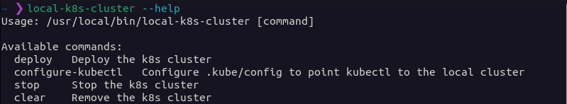

# Local-K8S-Cluster


This CLI tool makes it easy to set up and manage your own Kubernetes cluster on your local machine. With local-k8s-cluster, just define your cluster in a simple YAML file (k8s-cluster.yml) and run a single command to get it up and running.

## Project Overview

### Features

- _Simple Configuration_: Define nodes, memory, CPUs, and monitoring tools effortlessly in a YAML file.
- _Efficient Deployment_: Execute local-k8s-cluster deploy to effortlessly create virtual machines and configure Kubernetes with Ansible.
- _Command-Line Convenience_: Manage your local cluster with ease using commands like stop, clear, and configure-kubectl.

### Screenshots



## Getting Started

This section will guide you through the process to install and use the tool.

### Prerequisites

You will need:

- [Virtualbox](https://www.virtualbox.org/)
- [Vagrant](https://www.vagrantup.com/)
- [Ansible](https://www.ansible.com/)

installed in your system.

### Installation

To install the tool, it is recommended to clone the project from GitHub into the `/opt/local-k8s-cluster` directory:

```bash
sudo git clone https://github.com/joseandrestrujillo/local-k8s-cluster.git /opt/local-k8s-cluster
```

Once the project is cloned, you must create a symbolic link to the `local-k8s-cluster` script so that it can be executed from anywhere on the system:

```bash
sudo ln -s /opt/local-k8s-cluster/local-k8s-cluster /usr/local/bin/local-k8s-cluster
```

### Usage

The tool provides the following commands:

- `deploy`: Deploys the Kubernetes cluster.
- `configure-kubectl`: Configures the `.kube/config` file to point to the local cluster.
- `stop`: Stops the Kubernetes cluster.
- `clear`: Deletes the Kubernetes cluster.

#### Deploy

To deploy the cluster, you must run the following command

```bash
local-k8s-cluster deploy
```

This command will create two virtual machines with Vagrant and deploy the Kubernetes cluster with Ansible. The virtual machines will be created in the `/opt/local-k8s-cluster` directory with the names `master` and `worker`.

The `k8s-cluster.yml` file specifies the cluster configuration. The format of this file is as follows:

```yml
---
monitoring_tools: true
nodes:
  - name: master
    master: true
    memory: 2048
    cpus: 2
  - name: worker
    master: false
    memory: 2048
    cpus: 2
```

The `monitoring_tools` option specifies whether to install monitoring tools in the cluster.

The `nodes` section specifies the nodes in the cluster. Each node has the following attributes:

- `name`: The name of the node.
- `master`: Indicates whether the node is a master node.
- `memory`: The amount of memory allocated to the node.
- `cpus`: The number of CPUs allocated to the node.

#### Configure kubectl

To configure the `.kube/config` file to point to the local cluster, you must run the following command:

```bash
local-k8s-cluster configure-kubectl
```

This command will copy the `kubeconfig` file from the local cluster to the `~/.kube` directory.

#### Stop

To stop the cluster, you must run the following command:

```bash
local-k8s-cluster stop
```

This command will stop the virtual machines that make up the cluster.

#### Delete

To delete the cluster, you must run the following command:

```bash
local-k8s-cluster clear
```

This command will delete the virtual machines that make up the cluster and the configuration files.

### Monitoring tools

To run the weave scope monitoring tool, you can run the following:

```bash
kubectl port-forward -n weave "$(kubectl get -n weave pod --selector=weave-scope-component=app -o jsonpath='{.items..metadata.name}')" 4040
```

This command will open a local port on port 4040 that will connect to the weave scope monitoring server. You can access the monitoring server at the address http://localhost:4040.

## Contributing

As an open-source project, we welcome contributions of all forms.

If you have an idea or find a bug, please open an issue so we can discuss it. If you wish to contribute code, please open a pull request.

## Acknowledgments

This project is built upon the foundation laid by the fantastic work in the Ansible playbooks repository, which is licensed under the GNU General Public License v3.0. I extend my sincere gratitude to the original authors for their valuable contributions.

In the process of developing local-k8s-cluster, I've built upon and modified the Ansible playbooks to accommodate the specific requirements of this tool. Notably, I have tailored the code to support the deployment of Kubernetes clusters with more than two nodes.

Original Ansible Playbooks Repository: [kubeadm-cluster](https://github.com/AudelDiaz/kubeadm-cluster/tree/main).

## License

This tool is based on [this repository](https://github.com/AudelDiaz/kubeadm-cluster/tree/main).

[](./LICENSE)
